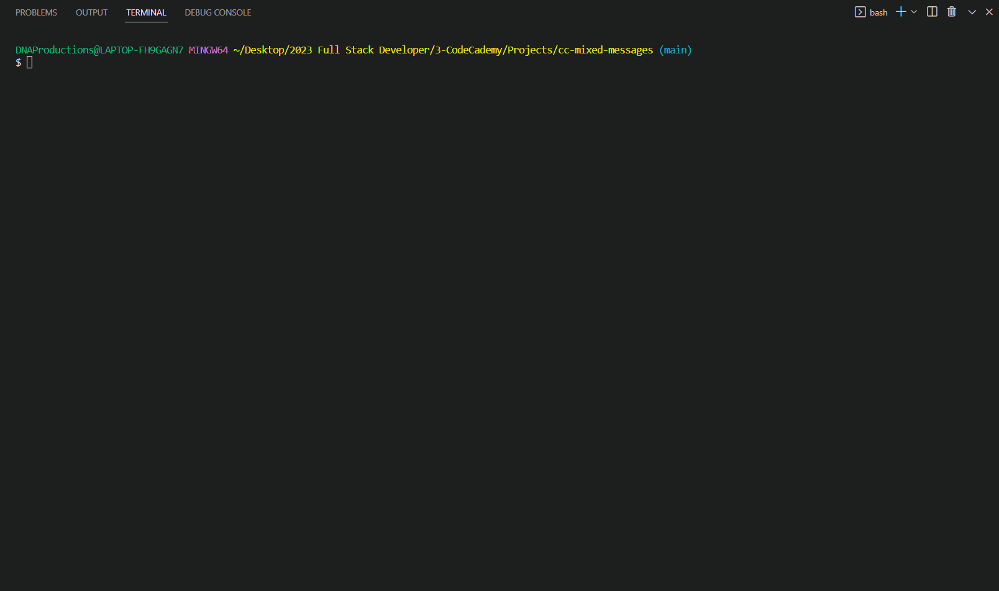

# Fortune Cookie Generator
Mixed messages generator that emulates fortune cookie messages

## Code Demo
<kbd></kbd>

## Instructions
* clone this repo
* using your software run file script.js

Note: 
* this code demo uses Node.js
* ran via vscode terminal through command `node script.js`

## Features
* outputs message comprised of three data variables
    1. colors with 7 variations
    2. quotes with 7 variations
    3. 7 unique lucky numbers chosen from 1 - 50
* includes function `fillLuckyNums(spots, choice)`: 
    * generate an array with length `spots`
    * fills in each index with a number between 1 and `choice`